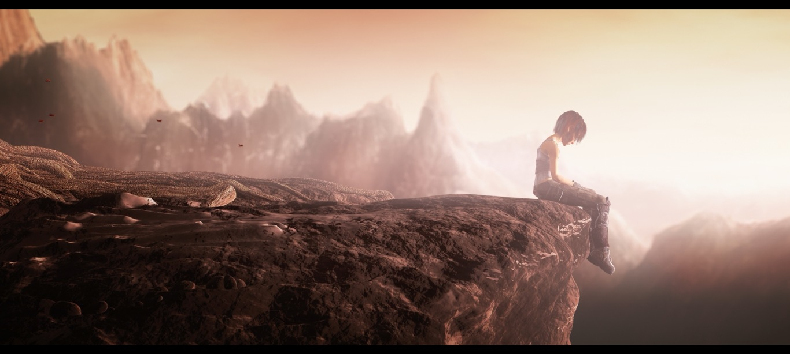
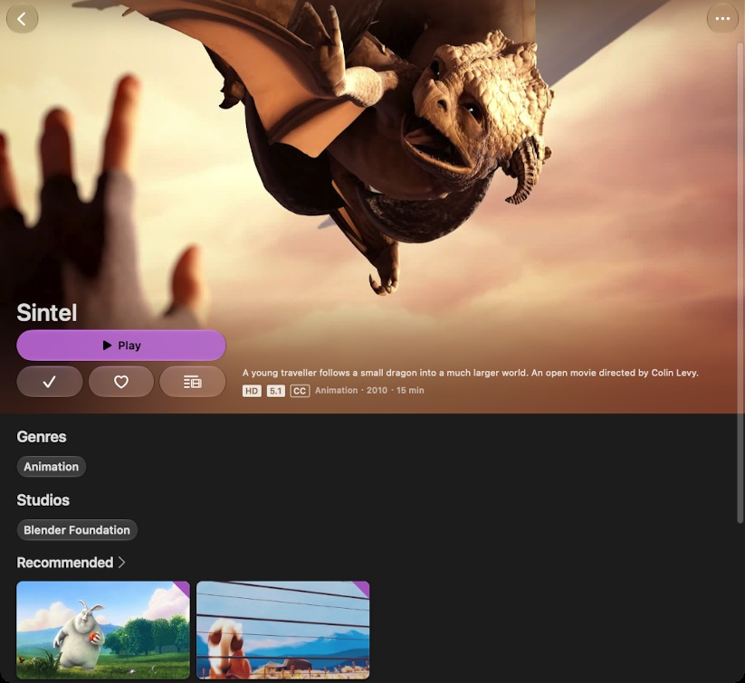
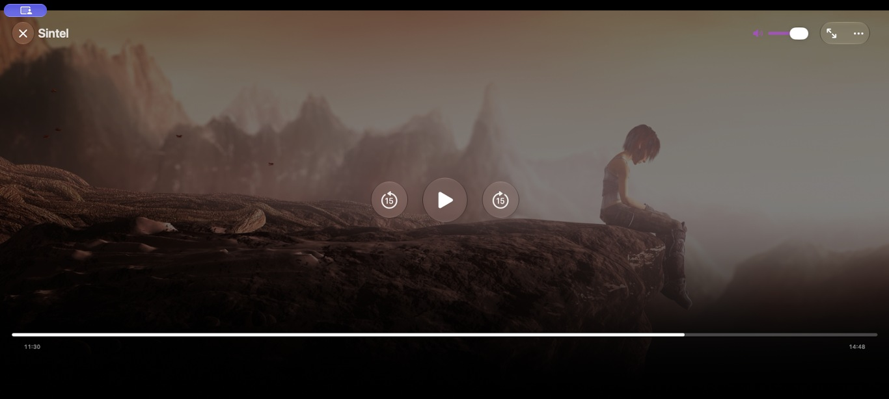

<p align="center"></p>

# Vela

**A modern macOS video player with Jellyfin built in.**

Your files. Your Jellyfin library. One player.



Watching a video shouldn't start with choosing an app. Open an MKV on your Mac,
or pick a film from your Jellyfin library. Use the same player. The controls
are there when you need them, then they get out of the way.

**Free. Open source. No subscription, in-app purchases or Pro tier.**

[Download Vela 0.9.4 for Mac](https://github.com/ralleur/Vela/releases/download/vela-0.9.4/Vela-0.9.4-macOS-universal-r2.dmg) · [Website](https://ralleur.github.io/Vela/) · [Release notes](https://github.com/ralleur/Vela/releases/tag/vela-0.9.4)

> **Vela 0.9.4 Beta is available as a universal DMG.** macOS 15.6 or later;
> Apple silicon and Intel. The app is Developer-ID signed and notarized by Apple.
> Open the disk image and drag Vela into Applications.

## Two ways to press play

**Your files.** On macOS, use **File → Open Video** (`⌘O`), Finder's **Open With**,
or drop a video into Vela. Local playback needs no account or server. Set Vela
as a format's default in Finder's Get Info → Open with → Change All if you want
to open it with a double-click. Vela doesn't change your associations for you.

**Your library.** Connect your Jellyfin server, browse its library, open a detail
page and start watching. Server progress, audio/subtitle preferences and
metadata-dependent episode features retain the Swiftfin client foundation.
Use `⌘O` to open a local file while browsing. On the Mac, the profile menu offers
**Settings** and **Accounts and Servers**.



## The small comforts

- **Pick up where you left off.** Up to 20 recent local files, positions and
  selected tracks stay on your Mac. Clear or disable history in Settings.
- **Choose what you hear and read.** Available audio tracks, embedded subtitles,
  and external SRT, ASS/SSA or VTT files, with timing controls in the track menus.
  Use `⇧⌘O` to add a subtitle; nearby matching files are discovered when access permits.
- **Stay on the keyboard.** Space to pause, arrows to seek, `⌘↑`/`⌘↓` for volume,
  `⌘F` or a double-click for fullscreen. Shortcuts and seek intervals are configurable.
- **Set your pace.** Playback speed controls, fullscreen and a floating mini
  player. The mini player is a floating Vela window, not system Picture-in-Picture.
- **Try the other engine.** VLC is the default for local files; **Try Compatible
  Playback** offers one retry with the bundled mpv alternative if a file fails.



Format behavior depends on the engine and file. There is no blanket claim of
all-codec, HDR or audio-passthrough support. See the [claim audit](docs/product-audit.md)
and [engineering evidence](VELA.md) for the tested scope.

## Built on Swiftfin, with gratitude

Vela is a fork of **[Swiftfin](https://github.com/jellyfin/Swiftfin)**. Swiftfin
and its contributors built the native Apple Jellyfin client foundation that
made this possible. Vela adds a broader Mac role: that client becomes useful
when the video happens to be a local file, too.

Vela is an independent project, not an official or endorsed Jellyfin or Swiftfin
application. Their names and marks belong to their respective owners.

## Platforms and status

| Platform | Current scope |
| --- | --- |
| **macOS** | Mac Catalyst; local files and Jellyfin. Build minimum macOS 15.6; launch captures on Apple silicon. Release is configured for Apple silicon and Intel. |
| **Apple TV** | Jellyfin browsing and playback; tvOS 26.1 target. Local Finder integration and file history are Mac features. |
| **iPhone / iPad** | Inherited iOS target remains in the repository; this launch does not announce a separately qualified Vela mobile release. |

Vela is beta software. Physical Apple TV behavior, oldest supported operating
systems and long-session reliability still need further qualification. Existing downloads are listed in
[releases](https://github.com/ralleur/Vela/releases); read their signing/version
notes before choosing a build.

## Build, understand, contribute

Requirements: macOS, Xcode (validated with Xcode 27) and signing configuration.

```sh
cp XcodeConfig/DevelopmentTeam.example.xcconfig XcodeConfig/DevelopmentTeam.xcconfig
# Set your team in the ignored local file.
CONFIGURATION=Debug Tools/vela/install-mac.sh
swift test --package-path Tools/VelaLogicTests
```

The Debug build stays in `build/dd-mac`; omitting `CONFIGURATION=Debug` builds
Release and replaces `/Applications/Vela.app`.

- [Build and installation guide](docs/BUILDING.md): signing, package patches, Mac and Apple TV.
- [VELA.md](VELA.md): architecture, source-independent playback, validation and upstream updates.
- [Contribution guide](Documentation/contributing.md): inherited Swiftfin engineering conventions.
- [Launch assets](marketing/README.md): screenshots, video, Shorts, credits and reproduction.
- [Website](website/README.md): static GitHub Pages build and publication instructions.

The player core accepts source-independent media, chapters and tracks. Local
files own their sandbox access and local history. The Jellyfin adapter owns
server models, streaming negotiation and server progress reporting. The engines
and playback UI are shared. Local playback doesn't create a Jellyfin progress
session; an already connected server may continue its normal browsing activity.

## License and acknowledgements

Vela source is under the [Mozilla Public License 2.0](LICENSE.md), retaining
Swiftfin's license and source notices. Thank you to Swiftfin, Jellyfin, VideoLAN,
mpv and the other projects in the [third-party notices](Shared/Resources/VelaThirdPartyNotices.txt),
also available inside Mac Settings.

Bundled playback binaries retain their own licenses. The release includes the
GPL-enabled mpv build; the combined binary is provided under GPL-3.0-or-later,
with Vela/Swiftfin source notices retained under MPL-2.0. See the
[distribution source and license record](docs/release/README.md) for matching
engine sources, patches, component recipes and the release source bundle.

Sintel © copyright Blender Foundation / [durian.blender.org](https://durian.blender.org/),
[CC BY 3.0](https://creativecommons.org/licenses/by/3.0/). Detail recommendations
also show Big Buck Bunny © 2008 Blender Foundation and Caminandes: Gran Dillama
© Caminandes team / Blender Foundation, (CC) caminandes.com (CC BY-SA 3.0).
The detail screenshot composition is CC BY-SA 3.0. Frames are cropped/resized
for demo artwork. See [media sources and licenses](marketing/sources-and-licenses.md).
