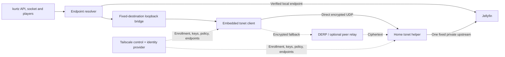

# kurtz Connect: feasibility and decision

Reviewed **3 October 2026** against kurtz `539b26351f329ca72e1bf14e7ad544590a9bf920` and the working tree. Investigation only; the production app is not changed. The pre-existing edits to language presets, track memory, player container, and `KURTZ.md` are outside this work.

## A. Verdict and decision

**Feasible with caveats.** Secure remote Jellyfin access without forwarding home ports is practical on all three platforms using an **external Tailscale client**. Embedding the transport is credible, particularly on macOS, but “Scan. Connect. Watch.” across Apple TV, iOS and the current Mac Catalyst app is **not yet a validated, App Store-ready feature**.

The best embedded candidate is **an app-owned Tailscale userspace node, a fixed-destination local media bridge, and a Jellyfin-only home helper**. It avoids a system VPN configuration and does not need a kurtz-operated backend when each household uses Tailscale's hosted coordination service. It still depends on that service, an owner account, enrollment, policy setup and an always-running home peer. Apple review classification, tvOS/Catalyst packaging, background behavior and sustained playback must be demonstrated before committing to it.

Decisions:

1. **Baseline:** external Tailscale plus a restricted Jellyfin service endpoint; document and qualify this first. Its Apple TV app already has QR enrollment.
2. **Research candidate:** embedded `tsnet` behind a small C/Swift boundary, scoped to a single approved Jellyfin service. Evaluate `libtailscale` before maintaining a larger bridge.
3. **Do not build** a custom WireGuard control/NAT/relay system. Do not make Headscale a mandatory household dependency or start a hosted multi-tenant kurtz networking service.
4. **Do not promise** no third-party account, no hosted dependency, no VPN prompt, arbitrary NAT compatibility and high-bitrate relay playback simultaneously. External Tailscale needs the prompt. The embedded alternative has unproven shipping gates. Reliable fallback for two unreachable peers requires some reachable relay.
5. **Existing release blocker:** kurtz's release record says the combined binary is GPL-3.0-or-later due to its GPL-enabled mpv build. The root MPL license alone is not an App Store clearance. Resolve native engine/distribution obligations independently before an App Store release.

**PoC gate, decided before implementation:** there is enough primary-source support to justify a disposable, native Swift/macOS + embedded `tsnet` experiment. Prove real HTTP through two userspace nodes and separately forced relay; do not treat a command-line `tailscale up`, a mocked HTTP response or a simulator compile as remote kurtz playback. The results section will distinguish measurements from outstanding work.

**Outcome:** the isolated native Swift/macOS experiment passed against a real disposable Jellyfin server, including login, library, video Range and AVPlayer startup over direct encrypted peers and forced local DERP. Separate tvOS and Catalyst archive/Swift-link checks passed. This establishes an implementation path, **not a production kurtz integration, WAN result or Apple TV runtime qualification**. See [the measured scope below](#11-isolated-proof-of-concept-and-evidence).

## Evidence and version boundary

| Component | Inspected snapshot |
| --- | --- |
| kurtz | Commit above; Xcode 27.0 (27A266a) installed |
| Jellyfin Swift SDK | Resolved 3.2.0, `bf2f30b9a17c03da82f47d8faa50a666043f2196` |
| Tailscale | Latest release API returned **v1.102.5**, `8908149cab706b043db0a3ffb967fbf0bfa9f9eb` (29 Sep); main `9128778b6515f32e13d92e7380044fe025f9b08e` inspected separately |
| libtailscale | Main `59d4bb82744915815178e0f0776d60026a397ee7` (31 Aug); its `go.mod` still pins **Tailscale 1.94.1**, not the latest release |
| WireGuard Apple | Official `master` `2fec12a6e1f6e3460b6ee483aa00ad29cddadab1` (15 Feb 2023); other development branches exist; this is not a claim that all WireGuard work stopped |
| Headscale | Latest release **v0.29.4**, `8106636c7f8d0cf8c9d4fb0beae94415069b768b` (23 Sep); main inspected but unreleased features are not assumed available |

Primary sources are linked at each decision. Apple API availability was checked in its DocC documentation JSON as well as the published technotes. Repository source, SDK headers and release records take precedence over remembered platform capabilities. Performance estimates below are explicitly not WAN measurements.

## 1. What kurtz actually does

| Area | Current implementation | Insertion point / consequence |
| --- | --- | --- |
| Platforms | Two application targets in `Swiftfin.xcodeproj`: `Swiftfin` and `Swiftfin tvOS`; no tunnel extension. iOS minimum **18.6**, tvOS **26.1**. Mac is **Catalyst**, not a separate AppKit target; release minimum **macOS 15.6** in `docs/BUILDING.md`. Mobile release is not separately qualified. | A native macOS library working is not proof of Catalyst support. New extensions would require new targets/profiles. |
| Discovery | `ConnectToServerViewModel._searchForServers` calls SDK `JellyfinClient.discover()`. SDK `Sources/ServerDiscovery.swift` broadcasts `who is JellyfinServer?` to **255.255.255.255:7359/UDP**. | This is LAN broadcast, not tailnet service discovery. Do not forward broadcasts or sweep the tailnet. |
| Server URLs | `ConnectToServerViewModel` normalizes addresses (defaults to HTTP), calls `/System/Info/Public`, follows the resulting origin, records server ID and URL. `ServerConnection` stores URL/interface/SSID/priority. | Register a logical remote service and LAN candidates, not a permanent random loopback port. Protect redirect handling. |
| Selection | `ServerConnectionManager` watches `NWPathMonitor`, probes matching candidates sequentially, verifies the returned server ID and announces a change. Auto-switch requires **both** the experimental preference and per-server switch. | Useful foundation, not a completed LAN-first failover feature. Wi-Fi alone does not imply home LAN. Existing 8/12-second probe timeouts can cause long startup delays across stale candidates. |
| Sessions/auth | `UserSession` lazily creates a `JellyfinClient` with `.swiftfin` URLSession configuration and access token. `UserSignInViewModel` uses Jellyfin authentication. `SwiftinStore+UserState.swift` stores access tokens in Keychain. | Overlay enrollment and Jellyfin authorization are distinct. Rebuild dependent clients after route changes; existing request URLs and player items do not mutate themselves. |
| HTTP | SDK 3.2.0 uses `Get`/URLSession; creation also occurs outside `UserSession` (`ServerState`, connection tests, sign-in). Images use Nuke and their own URL loading. | Setting a proxy only on `UserSession.client` misses pre-login probes, other clients and images. |
| WebSocket | `ServerSocketManager` delegates to SDK `JellyfinSocket`. SDK **creates `URLSession(configuration: .default)` independently**, sets Authorization and opens a socket. | A proxy injected in the API session will not cover this path. A common local origin or SDK change is necessary. |
| Playback URLs | `JellyfinMediaPlayerItem+Build.streamURL` produces transcode/HLS or static video URLs; additional source-path fallback exists. External subtitles, chapters, trickplay images and thumbnails are separate requests. SDK URL builders may put `ApiKey` in queries. | Need full origin coverage, Range/206, HEAD, redirects, HLS playlists/segments/keys, subtitles and WebSocket upgrades. Redact URL credentials. |
| Players | `AVMediaPlayerProxy` constructs **`AVPlayerItem(url:)`**. `VLCMediaPlayerProxy` uses **`Media(url:)`**, slave subtitle URLs. `MPVMediaPlayerProxy` calls **`player.load(item.url)`**, `sub-add` separately. | These do not inherit the API URLSession. `URLProtocol`, a Go HTTP client or a successful JSON GET alone cannot solve playback. |
| Signing | iOS entitlements currently contain Wi-Fi information; Mac contains Keychain group and user-selected file/bookmark access. No Network Extension or App Group entitlement. Shared xcconfig loads an ignored local development-team file. The Mac release is Developer-ID signed/notarized, outside the App Store. | Do not infer organizational developer enrollment from a signing team ID. A VPN product and Mac App Store packaging need separate review. |
| Transport policy | Plists allow arbitrary ATS loads, declare audio background mode and currently say no non-exempt encryption. Existing logging redacts specific password request bodies. | This is not a secure endpoint-pinning policy or proof all tokens are scrubbed. Review export declarations if adding crypto; audit auth URLs, query tokens, socket logs, crash reports and support bundles. |

Local source anchors: [connection manager](../Shared/Services/ServerConnectionManager.swift), [server enrollment](../Shared/ViewModels/ConnectToServerViewModel.swift), [user session](../Shared/Services/UserSession/UserSession.swift), [socket](../Shared/Services/ServerSocketManager.swift), [playback URL construction](../Shared/Kurtz/Playback/JellyfinMediaPlayerItem+Build.swift), [AVPlayer](../Shared/Objects/MediaPlayerManager/MediaPlayerProxy/MediaPlayerProxy+AVPlayer.swift), [VLC](../Shared/Objects/MediaPlayerManager/MediaPlayerProxy/MediaPlayerProxy+VLC.swift), [mpv](../Shared/Objects/MediaPlayerManager/MediaPlayerProxy/MediaPlayerProxy+MPV.swift), [release licensing](release/README.md).

### Two possible transport boundaries

**System packet tunnel:** establish a narrow destination route before probes/login and let OS sockets from all engines use it. Configure DNS, IPv4/IPv6, MTU, route exclusions and reconnect behavior. Exclude ordinary LAN destinations and never claim `0.0.0.0/0` merely for Jellyfin. This covers more networking without player modifications, but is a device VPN with consent and coexistence implications.

**Application userspace:** the Tailscale node is reachable only through explicit dial/proxy APIs. A stable, per-session **127.0.0.1/[::1] media endpoint**, forwarding only to the paired helper, can give the API client, socket and engines one conventional URL. It must be an authenticated, fixed-destination reverse proxy, never an unauthenticated SOCKS or arbitrary `CONNECT` service. Attach an unguessable per-session capability, reject foreign Host/Origin values and off-origin redirects, bind loopback only and close it with the session. HLS absolute references, URL bases and external resources require validation/rewrite or a supported engine proxy hook. Memory must be bounded with streaming backpressure.

An upstream `libtailscale` [URLSession extension](https://github.com/tailscale/libtailscale/blob/59d4bb82744915815178e0f0776d60026a397ee7/swift/TailscaleKit/URLSession%2BTailscale.swift) configures an authenticated SOCKS5 proxy through Apple's [session proxy API](https://developer.apple.com/documentation/foundation/urlsessionconfiguration/proxyconfigurations). That is useful for API experiments, but it does not replace the media bridge. A loopback URL also cannot be handed to an AirPlay/Cast receiver on another device; remote playback handoff is a separate unsupported case until designed and tested.

## 2. Architecture options

| Option | Feasibility / effort | UX and principal tradeoff | Decision |
| --- | --- | --- | --- |
| **A. External Tailscale** | Technically straightforward for network reachability; M for safe product integration | Supported clients on tvOS/iOS/macOS; another app, owner account and VPN consent remain. Existing Apple TV QR login solves device authorization, not Jellyfin discovery/login or restricted policy. | Baseline and first supported route |
| **B. Embedded WireGuardKit + NE** | Feasible with caveats; XL for complete product | OS routes cover engines, but VPN UI is unavoidable. Official Apple package advertises iOS/macOS, no tvOS build target. No enrollment/NAT orchestration/relay provided. | Reject as primary implementation |
| **C1. Embedded Tailscale + NE** | Technically possible but impractical as first step; XL | Reuses NAT/control/relay but still a system VPN. Need Apple wrapper, extension lifecycle, memory budget and signing; cannot copy the proprietary production Apple UI glue. | Only reconsider for a demonstrated background requirement |
| **C2. Embedded Tailscale userspace** | Feasible with caveats; L/XL | Best fit for app-only connectivity and no VPN-profile prompt. Must solve Swift/Go packaging, media bridge, scope, background lifecycle and review classification. | Isolated research candidate |
| **D. Headscale + Tailscale client** | Feasible protocol choice, impractical default for this UX; XL if kurtz-hosted | Removes mandatory Tailscale account/service, replaces it with a reachable HTTPS control server, identity/admin operations and relay responsibility. | Optional expert deployment only |
| **E. Custom WireGuard ecosystem** | Technically possible but impractical; XL throughout | We own NAT reliability, enrollment security, relays, abuse, updates and revocation forever. | Reject |

### A — what the baseline can and cannot automate

[Tailscale's Apple TV instructions](https://tailscale.com/docs/install/appletv) explicitly include Install VPN Configuration → Allow → Connect → scan QR/authenticate, then entering the media server's tailnet DNS name in the media app. They currently list tvOS 17+, recommend 18+, and include home-hub setup in prerequisites; qualify this on actual devices instead of assuming all TVs are configured alike. A user can already do most of the transport setup without typing keys on the remote.

kurtz should test an approved service address, not try to enumerate installed apps or control another app's VPN configuration. On iOS/tvOS, another app's Tailscale local administrative API is not a public cross-app discovery contract. MagicDNS answers a known machine name; it is **not a Jellyfin service directory**. A signed setup link/manifest or one entered service address is still needed. kurtz's UDP LAN discovery will not discover across a routed tailnet. macOS CLI/status integration could be optional diagnostics, not a requirement or credential scraper.

### B — WireGuard is the encrypted transport, not Connect

The official [WireGuard Apple package](https://git.zx2c4.com/wireguard-apple/tree/Package.swift?id=2fec12a6e1f6e3460b6ee483aa00ad29cddadab1) declares macOS 12 and iOS 15 and documents a separate Go build step. Its inspected default branch is old and pins a February 2023 `wireguard-go`; sparse default-branch activity and lack of tvOS recipes are maintenance/porting risks, not proof tvOS encryption is impossible. WireGuardKit's adapter expects `NEPacketTunnelProvider`. Its usual QR configuration contains a **long-lived private key**, unsuitable for the requested disposable pairing QR. [Upstream integration instructions](https://git.zx2c4.com/wireguard-apple/tree/README.md).

We would still need authenticated device identities, public-key distribution, address allocation, endpoint observation, NAT mapping renewal, rendezvous, UDP hole punching, relay transport, relay authorization, server policy, secure enrollment, multi-device administration, recovery and revocation. Plain WireGuard commonly needs a reachable UDP endpoint. Keepalive and authenticated roaming do not create a general CGNAT traversal service. Putting WireGuard on a VPS makes connectivity easier but turns the VPS into a permanent routing/bandwidth dependency; encryption may terminate there unless an inner end-to-end layer is maintained.

### C — embedded Tailscale, precisely

[`tsnet`](https://tailscale.com/docs/features/tsnet) is an upstream Go embedding API, with outbound dialing as well as listeners and a userspace TCP/IP stack. This is a real fit for an app-local client, even though many examples embed servers. It creates a distinct tailnet node per app instance. It does not install routes for AVPlayer/VLC/mpv, and is not an off-the-shelf Apple media-client SDK.

[`libtailscale`](https://github.com/tailscale/libtailscale/tree/59d4bb82744915815178e0f0776d60026a397ee7) supplies C archive/shared library entry points, Swift actors, dial/listen, login configuration, loopback proxy and status. Its checked-in build/CI covers native macOS and iOS/device+simulator; **no tvOS or Catalyst product recipe is present**. Its older Tailscale dependency must be assessed against current security fixes before distribution. The wrapper writes state to a directory; it does not automatically put node secrets into Keychain. Recent upstream code explicitly addresses status after iOS suspension, evidence that lifecycle correctness needs tests.

Use a C ABI / Go `c-archive` or evaluate the existing Swift wrapper. `gomobile bind` cannot export arbitrary Go internals and `net.Conn` as a ready Swift network stack; it would still require a small API boundary, buffer/FD ownership, cancellation, errors and lifecycle handling. Go has iOS/Darwin targets, not a stock `GOOS=tvos` or Catalyst target. Tailscale's public `tool/gocross/autoflags.go` contains tvOS SDK flags, so a Go-based tvOS client is credible; that is not a supported libtailscale tvOS XCFramework. Test actual target triples and link metadata; do not relabel an iOS archive as tvOS/Catalyst.

The core's internal packages are not a supported application API. Prefer `tsnet`, public local-client APIs and a pinned C surface; do not couple kurtz to `ipnlocal` implementation details. Tailscale describes its Apple GUI wrappers as [closed source](https://tailscale.com/blog/opensource). There is no evidence here that kurtz needs private Apple APIs, and no basis to assert the official clients use prohibited private APIs; their unavailable glue simply cannot be presumed reusable.

**Hosted service:** a household owner needs a Tailscale tailnet/account under its terms. Every watching device need not have a separate human account: an owner can authorize nodes, or a narrowly scoped helper can mint tagged node credentials. A friend can instead use their own account and accept a node share. Hiding all of that behind a kurtz brand is a separate commercial/identity integration, not something the BSD code license grants. [OAuth](https://tailscale.com/docs/features/oauth-clients) secrets belong on an owner-controlled helper or backend, never inside a distributed app. Do not ship one kurtz-wide auth key or put every household into an unrestricted shared tailnet.

Use persistent nodes for phones/TVs. Ephemeral nodes are useful for disposable tests, but sleep/offline removal and re-enrollment are poor defaults for household devices. Auth keys enroll nodes; node keys authenticate the resulting peers; OAuth/API credentials administer enrollment. Revoking an enrollment key does not revoke a node already enrolled. [Auth key lifecycle](https://tailscale.com/docs/features/access-control/auth-keys).

### D — Headscale does not remove the bootstrap service

Headscale [v0.29.4 feature list](https://github.com/juanfont/headscale/blob/v0.29.4/docs/about/features.md) includes basic registration, OIDC, preauth keys, DNS, IPv4/IPv6, ACLs/grants, ephemeral nodes and embedded DERP. Its [client matrix](https://github.com/juanfont/headscale/blob/v0.29.4/docs/about/clients.md) includes tvOS/iOS/macOS and targets a rolling set of Tailscale releases. Do not equate basic protocol compatibility with all hosted features: its documented Serve/Funnel/flow-log limitations matter, and Tailnet Lock/node-sharing parity must not be assumed.

The home helper can use `tsnet.ControlURL`/libtailscale's control URL; it is a Tailscale-protocol client, not a special “Headscale client”. Enrollment uses web/OIDC approval or a one-use preauth key issued by the Headscale administrator. The service needs a stable public HTTPS address, TLS maintenance and persistent identity/policy state. [Deployment requirements](https://github.com/juanfont/headscale/blob/v0.29.4/docs/setup/requirements.md). Hosting it behind the very CGNAT we are trying to traverse does not bootstrap a remote client.

An owner-hosted instance is reasonable for experts. A kurtz-hosted instance requires tenant isolation, account recovery, abuse prevention, backups, migration tests, monitoring, upgrades, incident response and redundant relays. Upstream explicitly targets a single tailnet for personal/small-organization use, not a ready multi-tenant SaaS. A small control-plane VM can be cheap; service ownership is permanent. Its embedded DERP is optional and its default map can retain Tailscale relays; that does not make relay service or bandwidth a kurtz entitlement. [DERP deployment](https://github.com/juanfont/headscale/blob/v0.29.4/docs/ref/derp.md).

### E — what a custom solution costs

| Subsystem | Work we would own |
| --- | --- |
| Identity / pairing | CSPRNG keys, signed device identity, channel binding, approval UI, replay-safe one-use transactions, recovery and key rotation |
| Rendezvous / reachability | Public authenticated endpoint, endpoint updates, presence leases, stale-state handling, IPv4/IPv6/NAT64 and roaming |
| NAT traversal | STUN observations, mapping/filtering behavior, ICE-like candidate checks, simultaneous open, keepalives, port changes, symmetric NAT and CGNAT failure paths |
| Relay | An authenticated packet relay (TURN alone is not a WireGuard integration), E2E ciphertext forwarding, quotas, rate limits, abuse controls, capacity and regional reliability |
| Authorization / revocation | Least-privilege destination policies enforced by the server, atomic changes, existing-connection termination, offline/revocation semantics, family/friend management |
| Operations | Protocol compatibility, updates, audits, telemetry minimization, incident handling, old client support and supply-chain maintenance |

Pion ICE/STUN/TURN or coturn can implement parts, but none supplies this full product. ICE is a candidate negotiation system, not an authorization policy or encrypted application session. This would reproduce much of Tailscale with a much smaller maintenance/security team.

## 3. Apple constraints by platform

| Issue | tvOS | iOS / iPadOS | macOS, including kurtz's Catalyst |
| --- | --- | --- | --- |
| Packet tunnel | Supported since **17.0**, app extension | Since **9.0**, app extension | macOS app extension since **10.11**, system extension since **10.15**; Catalyst provider deployment is separately documented |
| Consumer per-app VPN | **Not supported** in packet-tunnel deployment table | Per-app configuration requires managed apps/device via MDM | Do not mistake destination split routing for app isolation; Catalyst packaging restrictions apply |
| Distribution | Signed app and provider profiles | Signed app and provider profiles | Apple lists macOS/Catalyst **app-extension** packet-tunnel distribution as **App Store only**; Developer-ID delivery uses a native macOS **system extension**, with its own activation/signing path |
| User consent | Official Tailscale install explicitly requires Allow VPN Configuration | System VPN installation consent is part of setup | VPN/system-extension activation consent depends on packaging; cannot promise a silent install |
| On demand | `isOnDemandEnabled` is API-available from tvOS 17; actual intended behavior needs device testing | Supported rules and reconnect; not an unlimited always-on background entitlement | Supported; external Tailscale exposes custom On Demand in iOS/macOS |
| App suspension | Provider is separately managed by OS; foreground app need not stay running. Device sleep/termination still matters. | Same distinction; provider can outlive app but can be restarted/killed | System extension can outlive logged-in user; app extension is user-context. App-local userspace node lasts only with its process. |
| Another VPN | Treat consumer VPN coexistence as a conflict; qualify on device rather than promise two packet tunnels | Ordinary consumer device VPNs conflict; managed/per-app exceptions do not solve this product | Some combinations can coexist but route/DNS/address collisions remain; no universal compatibility guarantee |

Sources: Apple's [deployment matrix](https://developer.apple.com/documentation/technotes/tn3134-network-extension-provider-deployment), [packet provider](https://developer.apple.com/documentation/networkextension/nepackettunnelprovider), [on-demand property](https://developer.apple.com/documentation/networkextension/nevpnmanager/isondemandenabled), [routing rules](https://developer.apple.com/documentation/networkextension/routing-your-vpn-network-traffic), and Tailscale's [VPN coexistence](https://tailscale.com/docs/reference/faq/other-vpns) and [On Demand support](https://tailscale.com/docs/features/client/ios-vpn-on-demand). API availability is not a claim that the Tailscale tvOS UI exposes customized On Demand rules.

**Entitlements:** `com.apple.developer.networking.networkextension` with `packet-tunnel-provider` is required for the app/provider packaging; Developer-ID system extensions use the appropriate `-systemextension` value and system-extension installation entitlement. Shared secrets may need App Groups/Keychain groups and matching provisioning. Personal VPN entitlement alone does not authorize a custom provider. Apple's current [DTS clarification](https://developer.apple.com/forums/thread/814047) says Network Extension is **restricted, not managed**: a paid team can enable it without a special packet-tunnel entitlement approval application. This is separate from organizational membership and App Review.

**Review:** [Guideline 5.4](https://developer.apple.com/app-store/review/guidelines/#vpn-apps) requires VPN-service apps to use NEVPNManager, organizational developer enrollment, disclosure and restrictive data practices, plus applicable regional licensing. NETunnelProviderManager is the custom-provider manager in that family. Apple does not publish a blanket “media apps may never include VPN” rule, nor an approval for kurtz's exact use. A private-resource tunnel is an intended use; a packet extension used only to keep a local proxy alive is not. [TN3120](https://developer.apple.com/documentation/technotes/tn3120-expected-use-cases-for-network-extension-packet-tunnel-providers).

An app-owned userspace connection avoids creating a VPN configuration **technically**. Whether Apple classifies this particular feature as offering VPN services is an unresolved review question; omitting NE is not a legal/review bypass. Describe the real feature and submit a working, narrowly scoped test build before investing in polished enrollment.

**Lifecycle and power:** audio background mode only supports legitimate playback, not perpetual idle networking. A Go runtime, crypto, netstack, buffers and decoders share finite app resources. Providers have separate memory limits; historical “50 MB” figures are not current cross-device guarantees ([Apple DTS cautions](https://developer.apple.com/forums/thread/73148)). Reconnect after pause/suspension, locked-device Keychain accessibility, TV sleep/wake, Wi-Fi changes and long playback are explicit acceptance tests. Do not implement silent audio, keepalive tricks or a fake extension to evade suspension. An existing VPN can still block an app-local node's underlay traffic even when there is no second VPN profile.

## B. Recommended concrete design

### First supported product: external client, private Jellyfin endpoint

Apple TV/iOS/Mac run official Tailscale beside kurtz. At home, use a **dedicated service node** rather than advertising the whole LAN. Prefer an owner-installed userspace helper exposing one fixed Jellyfin upstream; external Tailscale + Serve is an alternative for an owner who already uses it. Use narrow policies and ordinary Jellyfin users. Store the approved endpoint in kurtz; prefer a verified LAN endpoint when available. kurtz owns no relay or control service.

### Embedded candidate: same helper, in-process client transport



| Part | Proposed responsibility |
| --- | --- |
| Apple TV | Foreground embedded node + media bridge; show device authorization QR and textual fallback. TV has no camera; another device scans its screen. Reconnect on resume. Physical-tvOS build/performance still a gate. |
| iPhone/iPad | Same node/bridge, browser authorization using system authentication UI, optional camera scan of home helper's setup invitation. Keychain state; legitimate playback background handling. |
| Mac | Same architecture compiled for **Catalyst**, with ARM64 and x86_64 slices; native macOS executable is only a preliminary proof. Developer-ID distribution initially avoids the unrelated App Store packaging transition. |
| Home helper | Unprivileged Go service/container, persistent identity, outbound connectivity, a tailnet listener on one fixed port (e.g. 8443) forwarding solely to Jellyfin's internal address. No subnet route, exit node, SSH, host network or arbitrary proxy. |
| Control plane | Owner's Tailscale tailnet and IdP; no kurtz control-plane accounts. Advanced users can configure compatible Headscale separately. |
| Data plane | WireGuard encryption via Tailscale; direct UDP where possible, optional configured peer relay, DERP as fallback. Retain Jellyfin login authorization. |
| NAT traversal | Tailscale endpoint discovery/STUN/DISCO, mappings and roaming; no custom ICE layer. Directness may improve after an initial relay connection; the UI must not promise never to touch a relay. |
| Relay | Tailscale's authorized hosted service initially; no 4K throughput guarantee. Private peer relay is an optional expert choice, not automatic household infrastructure. |
| Keys | Separate device-owned Tailscale state and Jellyfin token. Keychain-backed state store or encrypted state with a Keychain-held wrapping key; no sync/backup of private node keys by default. Current libtailscale directory storage must be adapted. |
| Pairing | Reuse Tailscale browser/device authorization first. Helper manifest binds approved node/service identity, Jellyfin ID and path. Add an owner-approved application pairing layer only if needed; no shared household private key. |
| Authorization | Deny by default; restrict client identity to dedicated helper TCP service. Helper enforces paired-device access independently and terminates revoked sessions. Jellyfin limits libraries/admin actions. |

`tsnet` can run without `/dev/net/tun`, `NET_ADMIN`, root or host networking because it supplies its own network stack. The helper needs ordinary outbound TCP/UDP, permission to persist its state and reach the fixed Jellyfin backend. In Compose, place it on Jellyfin's private Docker network, publish **no Jellyfin or helper media ports to the host**, and mount only its own state, not the Docker socket/media library. A minimal bootstrap UI can be loopback-bound or delivered through local command output. Configure the existing container's name/base path once; there is no honest universal `compose up` that discovers every user's unrelated Docker topology.

If the helper and Jellyfin are separate hosts, helper→Jellyfin HTTP is outside WireGuard encryption. Use TLS with verified identity on that leg or colocate on an explicitly trusted private/container network. For an independently authenticated helper, prefer application TLS/certificate pinning even within the overlay; a compromised coordinator otherwise controls who is introduced as a peer.

### LAN-first, without silently losing security

Probe local candidates without credentials; server ID is a useful match but **not a cryptographic identity**. A malicious LAN can imitate `/System/Info/Public`. **The current `ServerConnectionManager.test` accepts and supplies the access token before checking the returned ID**, so it must not be reused unchanged for untrusted discovered/pairing-provided candidates. Before sending tokens, require a previously approved/pinned HTTPS identity or the same helper's authenticated local service. If that cannot be established, keep using the encrypted overlay even at home (which can choose a direct LAN underlay). Plain HTTP LAN-first is a deliberate legacy trust decision, not equivalent security.

Select the route before creating a playback item. Preserve the Jellyfin base path. Use deadlines, cache successful candidates and avoid waiting for every stale address. Debounce transitions; rebuild API/session state and reopen WebSockets. For an in-progress video, recover at the saved position or keep a stable bridge origin; changing `currentURL` alone cannot migrate TCP sessions. The bridge must not leak an origin credential through redirects or remote absolute playlist URLs.

The helper also changes the source address Jellyfin sees. Configure trusted proxy handling and synthesize verified forwarding metadata so remote clients are not accidentally treated as local/trusted for Jellyfin access or bitrate policies. Never accept caller-supplied `X-Forwarded-For` as authority. Enforce Jellyfin user permissions even when the upstream socket is loopback or a Docker subnet. The PoC strips untrusted forwarding headers but does not qualify this production policy.

## 5. Pairing, isolation and device lifecycle

### Reuse existing primitives first

The simplest initial flow is **client displays Tailscale authorization URL/QR → owner approves in browser → node receives credentials locally → kurtz selects the approved Jellyfin service → normal Jellyfin login**. See [QR device authorization](https://tailscale.com/docs/features/access-control/device-management/how-to/set-up-qr-code). Do not claim undocumented TTL or replay semantics for that URL; rely on upstream behavior and verify expiry/reuse against the selected release. The QR does not contain a private node key.

A helper-generated QR can identify the server and initiate pairing, but a brand-new remote client cannot contact a helper reachable **only inside the network it has not joined yet**. It must first use the public Tailscale/Headscale enrollment channel, be paired locally before leaving home, or use another reachable rendezvous service. A QR is not a solution to this bootstrap dependency. Sending a one-use Tailscale auth key in QR is possible but exposes a bearer enrollment credential; it is less desirable than interactive approval and is not the proposed default.

### Proposed application invitation (if the upstream flow is insufficient)

This is a design requirement, not an implemented custom cryptographic protocol:

1. Helper creates a random **at least 128-bit** invitation secret, 5-minute expiry, service ID and helper signing-key fingerprint; store only the needed verifier and pending state. QR contains version, trusted enrollment origin, opaque invitation and public fingerprint, never permanent secret keys, OAuth credentials or Jellyfin tokens.
2. Device generates its own private keys locally. Over authenticated TLS after reachable bootstrap, present the invitation and device public key; owner sees the device and service and approves. Bind approval to that exact key and a fresh challenge. For short manually entered codes, use strict attempt limits and a vetted PAKE/device-authorization flow; do not treat six digits as a cryptographic key.
3. Atomically consume the invitation on successful enrollment. Concurrent/replayed/expired attempts fail; an abandoned attempt must not grant access. A stolen bearer QR can race the owner unless explicit device confirmation/channel binding is included.
4. Issue a restricted per-device authorization; if using Tailscale auth-key issuance, mint one-use, narrowly tagged credentials server-side after approval and deliver only over the bound channel. They never become durable credentials in QR or app logs.
5. Store durable device state in protected Keychain/encrypted storage, discard invitation material, and show the enrolled device in the owner's revocation list.

Do not pass arbitrary scan-provided control URLs to a credentialed client. Validate origin, invitation version/expiry, size and allowed schemes; custom private controllers require deliberate owner trust. A setup link must not become an SSRF path into the viewer's LAN. Use audited channel/authentication primitives rather than designing a new key-exchange algorithm.

### Expose Jellyfin, not the home network

An owner tailnet commonly begins with an allow-all policy. Grants are additive, so adding a narrow grant does **not** override an existing wildcard. The intended policy in a dedicated, owner-approved Connect tailnet is conceptually:

```json
{
  "tagOwners": {
    "tag:kurtz-viewer": ["autogroup:admin"],
    "tag:kurtz-jellyfin": ["autogroup:admin"]
  },
  "acls": [],
  "grants": [
    {
      "src": ["tag:kurtz-viewer"],
      "dst": ["tag:kurtz-jellyfin"],
      "ip": ["tcp:8443"]
    }
  ]
}
```

This is an illustrative dedicated-tailnet policy, **not something to paste over an existing user's rules**. With multiple households in one tailnet these shared tags would be insufficient isolation: use per-household identities/policy boundaries or separate tailnets. Validate real rules with positive/negative policy tests and network probes. Restrict tag assignment; end users must not self-assign privileged tags. [Default policy](https://tailscale.com/docs/reference/examples/acls), [grant union semantics](https://tailscale.com/docs/reference/syntax/grants).

A compromised client can bypass its own UI and dial anything its node is authorized for. Therefore the server/control policy, helper allowlist and container egress confinement enforce scope. No subnet routes/exit nodes. A friend should receive only the dedicated Jellyfin node/service, with [sharing quarantine](https://tailscale.com/docs/features/sharing) and narrow port grants, plus a separate non-admin Jellyfin user. Node sharing is not itself port-level authorization. If existing broad user-owned permissions cannot be constrained, do not claim the embedded node exposes only Jellyfin.

Each TV/phone gets a distinct identity; multiple family members should have appropriate Jellyfin users. Replacing a device means revoke/remove the old node and helper registration, revoke the Jellyfin session, then enroll the replacement. Deleting an auth key is insufficient. Disable a device at the helper immediately, close its active streams and push overlay revocation; offline partitions prevent a truthful promise of instantaneous global revocation. Never reuse/export the old private node key as the normal replacement workflow.

## 6. Threat model

| Threat | Required control and residual risk |
| --- | --- |
| Compromised kurtz device | Server-enforced port/destination grants and helper allowlist limit lateral movement. Attacker can use that user's allowed Jellyfin content/session until revoked; the tunnel cannot protect a compromised endpoint. |
| Stolen QR / enrollment replay | Short TTL, high entropy, atomic single use, owner confirmation and binding to device key; prevent log/referrer leakage and brute-force short codes. Already-authorized malicious devices require revocation, not just token expiry. |
| Compromised coordinator / kurtz backend | No kurtz backend in recommendation. Hosted coordinator can influence keys, membership and policies and observe metadata. Independently pinned helper TLS/application identity or correctly operated Tailnet Lock limits peer substitution; these add recovery/enrollment complexity. |
| Malicious relay | WireGuard ciphertext remains E2E; relay can observe timing/size/IP metadata, drop or delay packets. It cannot decrypt correctly authenticated peer traffic. Relay identity/authorization/rate limits still matter. |
| Compromised Jellyfin / helper | Remote endpoint sees plaintext/content; sandbox helper, fixed upstream, no Docker socket, no arbitrary home routes. Jellyfin compromise is not fixed by overlay encryption. Separate helper→Jellyfin TLS if it crosses an untrusted network. |
| Credential leakage | Keychain-backed state, no embedded reusable auth/OAuth keys, redact login URLs, authorization headers, query tokens and logs. Do not forward credentials across origins. Keychain does not protect secrets from a fully compromised unlocked process. |
| LAN or pairing MITM | Cryptographically bind helper/server identity; unauthenticated Jellyfin ID/discovery is insufficient. Validate TLS and explicit fingerprints; avoid implicit trust-on-every-reconnect. |
| Local bridge attack | Loopback-only, per-session capability, fixed upstream, no CONNECT, tight Host/Origin/path checks, no CORS wildcard, bounded resources. Another local process or browser must not get a general tunnel. |
| Leaked device key / revoked user | Separate node per device, rotation/re-enrollment, helper revocation and stream teardown, Jellyfin session revocation. Persist deny state across helper restarts; define behavior during control-plane outages. |
| Supply chain / malicious setup link | Pinned versions/checksums, transitive license/security inventory, signed updates, restricted bootstrap origins and no downloading executable code from pairing URLs. |

Sources: [DERP encryption](https://tailscale.com/docs/reference/derp-servers), [Tailnet Lock trust model](https://tailscale.com/docs/features/tailnet-lock), and the policy/key sources above. The smallest **kurtz-maintained** attack surface today is external Tailscale + a dedicated service endpoint. Userspace embedding offers tighter app scope but adds a Go runtime and a security-sensitive media bridge inside kurtz.

## 7. Licensing and hosted-service rights

Read upstream license files, not GitHub badges. This is an engineering distribution assessment; final App Store license clearance must cover the exact linked binary and terms, including existing native players.

| Code / service | Verified license source | Distribution consequence |
| --- | --- | --- |
| kurtz/Swiftfin source | [MPL-2.0](../LICENSE.md) | Preserve notices; make covered modified files available in source under MPL. Larger-work rules permit separate files under other terms. |
| Current kurtz combined executable | [Release record](release/README.md): GPL-3.0-or-later via GPL-enabled mpv/FFmpeg combination | Existing source/relinking and recipient-rights obligations; App Store usage/DRM terms are a material unresolved compatibility issue. Replacing/removing/rebuilding GPL engines or obtaining suitable additional permissions is a separate project, not solved by Tailscale's license. |
| Tailscale core, `tsnet`, DERP/DISCO code | [BSD-3-Clause at v1.102.5](https://github.com/tailscale/tailscale/blob/v1.102.5/LICENSE) | Embedding allowed; copyright/license/disclaimer in binary notices; no endorsement. No copyleft relicense of kurtz imposed by this core. |
| libtailscale / Swift wrapper | [BSD-3-Clause](https://github.com/tailscale/libtailscale/blob/59d4bb82744915815178e0f0776d60026a397ee7/LICENSE) | Same notice requirements; separate dependency pin/security review. |
| WireGuard Apple / WireGuardKit | [MIT](https://git.zx2c4.com/wireguard-apple/tree/COPYING?id=2fec12a6e1f6e3460b6ee483aa00ad29cddadab1) | Linking permitted with copyright/permission notice; not GPL merely because the name is WireGuard. |
| wireguard-go and Tailscale fork | [Official MIT](https://git.zx2c4.com/wireguard-go/tree/LICENSE), [fork MIT](https://github.com/tailscale/wireguard-go/blob/master/LICENSE) | Preserve notices for exact revision shipped. |
| WireGuard Linux kernel / `wireguard-tools` | [Tools GPLv2](https://git.zx2c4.com/wireguard-tools/tree/COPYING); kernel licensing is distinct | Not required for embedded Apple userspace design. If shipped in a helper image, track their source obligations independently; do not assume MIT covers all WireGuard artifacts. |
| Headscale | [BSD-3-Clause v0.29.4](https://github.com/juanfont/headscale/blob/v0.29.4/LICENSE) | May self-host/redistribute with notices; dependency inventory still required. |
| gVisor netstack | [Apache-2.0 plus third-party notices](https://github.com/google/gvisor/blob/master/LICENSE) | Retain license/notices and required attribution; mark modifications. Does not require opening unrelated kurtz files. |
| Go runtime / `x/crypto`, `x/net`, etc. | [Go BSD-3-Clause](https://go.dev/LICENSE), [crypto](https://cs.opensource.google/go/x/crypto/+/master:LICENSE), [net](https://cs.opensource.google/go/x/net/+/master:LICENSE) | Include notices for compiled transitive modules; cryptographic export analysis is distinct. |
| Pion ICE, STUN, TURN (option E only) | [ICE MIT](https://github.com/pion/ice/blob/master/LICENSE), [STUN MIT](https://github.com/pion/stun/blob/master/LICENSE), [TURN MIT](https://github.com/pion/turn/blob/master/LICENSE) | Permissive, but not selected dependencies. |
| coturn (alternative relay) | [BSD-3-Clause](https://github.com/coturn/coturn/blob/master/LICENSE) | Notices; does not implement Tailscale DERP protocol. |
| NetBird alternative | [Root BSD-3-Clause with exceptions](https://github.com/netbirdio/netbird/blob/main/LICENSE); management/signal/relay/combined are AGPLv3 | Do not call the whole product BSD. Modified network-served AGPL components carry source-offer obligations; independent deployment need not relicense the kurtz client. |
| ZeroTier alternative | [License map](https://github.com/zerotier/ZeroTierOne/blob/dev/LICENSE.txt), [MPL core](https://github.com/zerotier/ZeroTierOne/blob/dev/LICENSE-MPL.txt), [nonfree license](https://github.com/zerotier/ZeroTierOne/blob/dev/nonfree/LICENSE.md) | Current source tree mixes MPL and source-available components. Determine exact linked subtree/SDK rights before selecting; do not repeat a blanket “all BSD” or older blanket license claim. |
| cloudflared alternative | [Apache-2.0](https://github.com/cloudflare/cloudflared/blob/master/LICENSE) | Code license does not grant hosted streaming/service rights. |

The native PoC additionally produced a [compiled Go-package license inventory](../Tools/KurtzConnectPoC/evidence/third-party-licenses.csv) and [SHA-256 evidence for 34 upstream license files](../Tools/KurtzConnectPoC/evidence/license-hashes.json). For example, the selected `coder/websocket` is **ISC**, and the gVisor/compress license files include multiple third-party grants. This target-specific evidence is more precise than a root-license-only summary. The scanner flags C/assembly limits; Go runtime, Apple frameworks, embedded web assets, lab-only dependencies and eventual iOS/tvOS/Catalyst binaries still require complete release inventories.

**Hosted Tailscale is a separate contract.** Its [terms updated 25 August 2026](https://tailscale.com/terms) contain service-use/commercialization and benchmarking restrictions; BSD source permission is not a promise of white-label service or unlimited relay capacity. User-owned tailnet use is the baseline. Obtain an applicable OEM/service arrangement before a bundled kurtz offering makes different promises. Perform transport benchmarks against locally operated test control/relay infrastructure, not by load-testing the hosted service.

A production binary needs a reproducible per-target SBOM and full compiled-dependency notice inventory. Upstream's [Apple dependency list](https://github.com/tailscale/tailscale/blob/v1.102.5/licenses/apple.md) is a starting point, not proof it matches our `tsnet` build. Main-branch license references above were read on the review date; pin them to the eventual selected revisions. No newly selected permissive networking dependency forces a new kurtz license, but the existing GPL combination remains significant.

## 8. Performance, capacity and measurement

The speed of a tiny JSON GET says nothing about remux playback. Sustainable useful throughput is bounded by home **upload**, client download, Wi-Fi/Ethernet, latency/loss, the helper, crypto/netstack CPU and relay capacity. Direct WireGuard and direct Tailscale are both credible at these rates on suitable hardware; no measured Apple TV number is available yet. Userspace adds netstack/proxy copies and Go GC; do not transfer kernel/Linux WireGuard benchmarks to kurtz's Apple TV process.

| Video bitrate | Payload per hour, decimal GB | 2-hour film | Proposed sustained test target (1.5× headroom) | Egress cost/hour at illustrative $0.01 / $0.09 per GB |
| --- | ---: | ---: | ---: | ---: |
| 20 Mbps | 9 | 18 GB | 30 Mbps | $0.09 / $0.81 |
| 50 Mbps | 22.5 | 45 GB | 75 Mbps | $0.225 / $2.025 |
| 100 Mbps | 45 | 90 GB | 150 Mbps | $0.45 / $4.05 |
| 150 Mbps | 67.5 | 135 GB | 225 Mbps | $0.675 / $6.075 |

Formula: `GB = Mbps × seconds / 8 / 1000`; payload only. The margin and price bands are **planning assumptions**, not guarantees or vendor quotes. Add encryption/transport overhead, retries, seeks and concurrent viewers. A 100-Mbps interface cannot carry a sustained 100+ Mbps remux with overhead; check the actual Apple TV model/link rather than assuming all TVs have gigabit Ethernet.

| Path | Expected practical implication |
| --- | --- |
| LAN direct | Lowest transport overhead; still subject to Wi-Fi/storage/decoder limits and local trust policy. Measure against same content/server as remote routes. |
| Direct WireGuard / Tailscale | Normally best remote route. Must verify hardware CPU, memory, thermal load, RTT/loss and background playback, not infer from protocol reputation. |
| Hosted DERP | Fallback availability, not a 4K service level. Upstream explicitly [limits DERP throughput for fairness](https://tailscale.com/docs/reference/troubleshooting/poor-performance-tailnet). 20 Mbps may work; 50/100+ Mbps must not be promised. |
| Private peer relay / DERP | Can provision higher capacity but becomes a paid, monitored dependency. New Tailscale [peer relays](https://tailscale.com/docs/features/peer-relay) deserve consideration; they must be configured and reachable, and do not eliminate bandwidth costs. |

Track actual per-peer route **after traffic** with local-client ping/status, byte deltas and connection state. A nonempty `Relay` field can describe a home DERP region while a direct path exists; it is not sufficient alone. Distinguish direct LAN URL, encrypted direct peer traffic, peer-relayed traffic, DERP, mixed/transitioning and unknown. Do not infer directness from a `100.x` address or a successful HTTP request. Endpoint/relay changes can occur midstream.

Acceptance suite: real devices at 20/50/100/150 Mbps, static MP4/MKV and transcoded HLS, seek/range, subtitles/trickplay, WebSocket reconnection, IPv6-only/NAT64, CGNAT/hard NAT, blocked UDP, relay forced, Wi-Fi→cellular, another VPN, two-hour playback, pause/sleep/resume and device revocation midstream. Capture useful Mbps, startup/seek latency, stalls, CPU, peak RSS/footprint, energy/thermal state and underlay/relay evidence. When relay capacity is inadequate, request lower Jellyfin bitrate/transcoding and explain it simply; do not silently claim original quality.

## 9. Simpler alternatives

| Alternative | Requirement fit |
| --- | --- |
| HTTPS + reverse proxy | Broad player compatibility and good performance, but public origin, domain/certificate and firewall work violate the stated goal. Keep as an existing expert choice. |
| Cloudflare Tunnel public hostname | Removes home inbound ports but publishes an endpoint via Cloudflare; Access login/cookies/service headers do not automatically integrate with all native media paths. Current [routing docs](https://developers.cloudflare.com/tunnel/concepts/routing/) require appropriate paid products for video/large-file delivery on public routes. |
| Cloudflare private routes | No public application, and the public-route video restriction does not apply according to its [FAQ](https://developers.cloudflare.com/cloudflare-one/faq/cloudflare-tunnels-faq/); requires supported private client/routing. No verified native tvOS path established in this review; not a better proven UX. TLS-terminating reverse proxies also differ from an E2E WireGuard relay threat model. |
| Tailscale Serve | Useful private home-side HTTP endpoint, automatic tailnet HTTPS possible; client still needs Tailscale reachability and policy. Can simplify option A. [Serve](https://tailscale.com/docs/features/tailscale-serve). |
| Tailscale Funnel | Public service exposure and non-configurable bandwidth limits conflict with goals. [Funnel limitations](https://tailscale.com/docs/features/tailscale-funnel). |
| Normal Tailscale | Best verified baseline: Apple TV app, QR auth, peer connectivity and encrypted fallback; explicit VPN/account setup remains. |
| NetBird | **Current tvOS app exists**, tvOS 17+, documented **beta** with VPN consent and QR/SSO. Credible external alternative; it is wrong to reject it as lacking Apple TV support. More self-host infrastructure and a different licensing split; no demonstrated simpler embedded media SDK. [Official tvOS instructions](https://docs.netbird.io/get-started/install/tvos). |
| ZeroTier | Public downloads reviewed list iOS/macOS, but no verified official tvOS product there. Its userspace SDK is worth awareness, not evidence of supported kurtz/tvOS packaging. Additional identity/control/license investigation needed. [Official downloads](https://www.zerotier.com/download/). |
| Plain WireGuard | Efficient and simple after endpoints/keys are configured, but does not supply the requested NAT/enrollment/relay UX. |

## C. User experience and honest step counts

Count deliberate user actions/decisions, not every keystroke or automatic transition. Installation prerequisites and owner-only setup are not hidden in the count.

**Baseline household owner: 5 setup actions** with a prepared helper package and existing Jellyfin/Docker: (1) create/sign in to Tailscale; (2) install/start helper Compose package and identify the internal Jellyfin upstream; (3) approve the helper in the browser; (4) approve the supplied restricted policy (or have an administrator merge it safely); (5) obtain the server setup link/address. Docker installation, an unsupported NAS or a complicated existing policy adds work. This is already more than “one Docker command”.

**Baseline new Apple TV: 8 actions:** (1) install/open Tailscale; (2) choose Install VPN Configuration and Allow; (3) Connect; (4) scan displayed code and approve/sign in on a phone; (5) install/open kurtz; (6) add the supplied private server address (a future setup handoff can remove typing); (7) Jellyfin sign-in/Quick Connect where already supported; (8) choose a video. Home-hub/device-approval setup adds steps when applicable. iOS/macOS replace TV QR scanning with browser approval, still involving two apps and VPN consent.

**Embedded target, after owner setup: 5 actions:** (1) install/open kurtz; (2) Connect remotely; (3) scan the TV code/approve in phone browser, or browser-authenticate on iPhone/Mac; (4) sign into the approved Jellyfin server; (5) choose a video. If more than one service is available, selecting it adds a sixth action. Authentication/MFA screens can add interactions. Subsequent launches should simply show the library and select the best verified path.

The helper-generated “scan this code” variant fits a camera-equipped iPhone, not an Apple TV. The TV should show its own request code for an owner to approve. A short textual URL/code provides a camera-free alternative; it needs expiry and rate limits. Normal successful playback need not display VPN/IP/DNS/DERP terminology. External setup and OS consent cannot honestly hide it all. UI errors can say “Home server is offline”, “Approval expired”, “This device was removed”, or “Using a slower connection; lower quality may help”.

## D/E. Dependencies and ongoing cost

| Class | Baseline | Embedded candidate |
| --- | --- | --- |
| Open source shipped by kurtz | Existing player/client stack; optional dedicated helper built with tsnet | Plus Tailscale/Go/netstack/crypto bridge and notices; optional libtailscale |
| Apple APIs/services | Ordinary app networking, Keychain; external Tailscale owns NE; App Store/Developer-ID signing | URLSession, Network/loopback, Keychain, static framework signing; NE only if a later architecture explicitly chooses it |
| Hosted third party | Tailscale coordination, identity provider, DNS/DERP service under user's plan | Same; service/OEM agreement may be necessary for a branded integration |
| Owner infrastructure | Always-on Jellyfin + helper state/container | Same; optional expert Headscale/relay |
| Mandatory kurtz infrastructure | **None** | **None** with owner-account flow; not true of a custom anonymous global pairing service |

Current [Tailscale pricing](https://tailscale.com/pricing) lists Personal at $0, up to six users, unlimited user devices, a starting allowance of 50 tagged resources and 1,000 monthly ephemeral-resource minutes. These are current plan facts, not a redistribution or high-bandwidth SLA. Standard is listed at $8/user/month and tagged resources have separate pricing; OEM/multiple-tailnet arrangements require their pricing discussion. Do not base permanent product economics on an old “3 users / 100 devices” assumption.

For a kurtz-run alternative, a **planning allowance** of $10–40/month could cover a small nonredundant control VM/storage/backups before labor; this is not a provider quote or production HA budget. Relay traffic dominates: 1,000 viewing hours/month at 50 Mbps is **22.5 TB payload** → **$225–$2,025** at the illustrative egress bands above; at 100 Mbps, **45 TB** → **$450–$4,050**. If only 10% of viewing is relayed, multiply those bandwidth numbers by 0.1. A relay receives and forwards roughly twice the payload on its NICs; providers may bill outbound only or both directions, and multi-relay paths can incur additional egress. Budget separately for CPU, redundancy, DDoS/abuse, observability and people. One hundred concurrent 100-Mbps streams require roughly **10 Gbps outbound plus inbound**, before overhead.

No kurtz backend eliminates these kurtz bills, not the home's upload/electricity or the third party's availability/terms. Headscale moves control costs to whoever operates it; it does not abolish them.

## F/G. Blockers, complexity and go/no-go criteria

| Subsystem | External baseline | Embedded userspace | Embedded NE / custom product |
| --- | --- | --- | --- |
| kurtz endpoint/session integration | M | L | M/L |
| Network Extension | None in kurtz | None in candidate | L (WireGuard), XL (full embedded Tailscale lifecycle) |
| Server helper | M | M | M/L |
| Pairing / owner approval | M | L | L/XL |
| Control plane | Existing service | Existing service | XL if self-operated multi-tenant |
| Relay | Existing service | Existing service; qualify | L operations, XL custom protocol/service |
| Security / isolation / revocation | L | XL | XL |
| Build, signing, deployment | M | L/XL across Apple slices | XL with extensions/system extension |

S/M/L/XL describe relative uncertainty and integration burden, not time estimates. Custom option E is XL overall even if the WireGuard API itself is small.

Release-stopping gates, in order:

1. **Identity/isolation:** prove a compromised client identity cannot reach another home device/port/household; stolen/replayed invitations and revoked devices must fail.
2. **Distribution:** resolve native-player GPL distribution compatibility with App Store terms and determine whether Apple classifies the embedded feature under 5.4. Organizational status is not established here. Entitlement availability is not approval.
3. **Platform proof:** reproducible, signed tvOS and Catalyst builds with correct native slices; real-device playback/suspension. iOS package success is insufficient.
4. **Data-path coverage:** API, authentication, images, socket, all shipped players, HLS/Range/subtitles; fail closed on remote redirects and untrusted LAN identity.
5. **Reliability/quality:** acceptable direct and relay behavior, measured headroom at agreed bitrates; graceful downgrade/error when relays cannot sustain a stream.
6. **Service terms and maintenance:** rights to the intended hosted integration, security update cadence, per-target dependency notices, documented recovery/revocation, no embedded service credentials.

If users reject an owner Tailscale account and kurtz will not operate or pay for a control/relay provider, the full reliable remote “scan-only” promise is **currently not viable under those combined constraints**. Local-first pre-pairing can simplify enrollment but cannot guarantee direct traversal of every NAT.

## 11. Isolated proof of concept and evidence

The approved research boundary is `Tools/KurtzConnectPoC/`; no production targets, entitlements or player code are to change. Use an isolated local control/DERP lab and temporary node state. Local test infrastructure is deliberately not production enrollment infrastructure. Record actual server versus fixture, native versus Catalyst/tvOS, direct versus relayed, tested operations, timings and memory. WAN NAT traversal and physical-device behavior remain unverified unless actually exercised.

### Executed results

Reproduction: [PoC README](../Tools/KurtzConnectPoC/README.md). Raw sanitized [measurements](../Tools/KurtzConnectPoC/evidence/results.json) and [cross-platform link output](../Tools/KurtzConnectPoC/evidence/build-checks.txt) are checked in. Host: Apple silicon **Mac16,9**, macOS **27.0**, Xcode **27.0**, Go **1.27.1**; Tailscale **1.102.5**; disposable genuine **Jellyfin 10.11.11** container (image digest in evidence). No user's server, account, library or credentials were used.

| Experiment | Result | Exact limit of evidence |
| --- | --- | --- |
| Native Swift → embedded tsnet → helper → `/System/Info/Public` | **Passed**, actual Jellyfin ID/version | Both peers and control/relay on one Mac; not an Internet path |
| Jellyfin authentication + library | **Passed**, random temporary account, one generated movie | No existing account credentials; no enrollment/pairing product |
| Static movie HTTP Range | **Passed**, 206 and exactly 1,024 requested bytes | Does not cover all container/HLS/subtitle paths |
| Native AVPlayer | **Passed**, real streamed 720p H.264 MP4, timeline advanced >0.5 s on each path | Native macOS command-line probe; no production kurtz, VLC/mpv or long playback validation |
| URLSession WebSocket | **Passed**, echo through local bridge and overlay | Fixture; not Jellyfin application session/remote commands |
| Direct peer | **Passed**, DISCO direct endpoint before/after, increasing byte counters | Same-machine endpoint discovery; no hard-NAT/CGNAT/WAN test; transient route changes not sampled continuously |
| Forced DERP | **Passed**, direct UDP disabled for test process; local relay reported before/after, counters increased | Local self-operated DERP, not Tailscale-hosted DERP throughput or NAT failure detection |
| Bridge negative tests | **Passed**, capability/Origin/Host/CONNECT/arbitrary target/redirect and forwarding-header cases | No comprehensive proxy security audit, server grant isolation or revocation test |
| tvOS arm64 archive + Swift dynamic-library link | **Passed**, `LC_BUILD_VERSION: TVOS`, minimum 26.1 | Not a signed app, simulator run or physical TV test |
| Catalyst arm64 archive + Swift dynamic-library link | **Passed**, `LC_BUILD_VERSION: MACCATALYST`, minimum iOS-ABI 18.6 | Not a Catalyst app run; Intel slice outstanding |

Three **uncached 32-MiB synthetic transfers**, measured with a monotonic clock:

| Path | Samples (Mbps) | Median | Probe peak RSS | Whole-probe CPU seconds |
| --- | --- | ---: | ---: | ---: |
| Unencrypted loopback baseline | 17,432.5 / 28,878.7 / 25,130.0 | 25,130.0 Mbps | 134.1 MiB | 0.14 |
| Embedded direct peer | 660.4 / 766.9 / 719.6 | 719.6 Mbps | 254.9 MiB | 1.98 |
| Embedded forced local DERP | 216.5 / 273.5 / 295.9 | 273.5 Mbps | 156.2 MiB | 2.73 |

These are **short, same-host synthetic transfer measurements**, not real LAN speeds, 4K bitrate qualifications or a DERP service promise. Loopback can move memory far faster than physical links. The test deliberately buffers each 32-MiB response; RSS includes Swift/Foundation, AVPlayer, Go and allocation/GC timing. It is neither the idle transport footprint nor a valid packet-extension memory estimate. CPU seconds cover different startup/transfer/playback durations (1.62 / 2.42 / 7.37 seconds wall time), not steady-state CPU percentages or battery cost. Helper/relay CPU and memory are outside those process numbers. Sustained 20/50/100+ Mbps playback on real devices remains unmeasured.

The experiment shows that a media engine can consume an ordinary local URL while its bytes travel through an embedded encrypted userspace overlay. It also exposes the real integration work: the loopback bridge, cancellation/lifecycle, state protection, helper identity and target-specific packaging. It does not establish Apple's review treatment of this design.

### What was intentionally not implemented

No production UI or network changes, QR generator, custom key exchange, public backend, Network Extension, Keychain store, signed Apple app, deployable Docker helper, real grants/tenant isolation, real remote server, HLS rewrite or VLC/mpv adaptation. The test controller is deliberately permissive and must never be deployed; self-signed relay TLS acceptance is confined to its local test DERP map. Temporary containers/networks, passwords and node state were removed after the run.

**Next decision:** retain external Tailscale as the supported baseline; authorize a product integration only after a signed physical-tvOS/Catalyst playback spike, restrictive policy/revocation tests and distribution review resolve the top gates. Do not turn this lab into a public Connect service by replacing its control URL.
